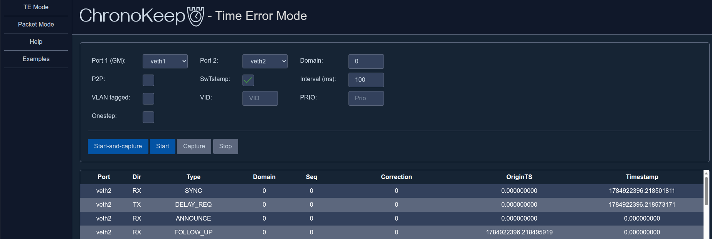
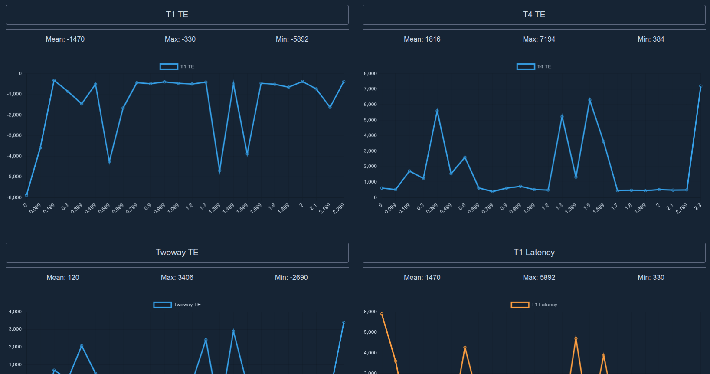

<!-- SPDX-License-Identifier: MIT -->
<!-- SPDX-FileCopyrightText: 2026 Casper Andersson <casper.casan@gmail.com> -->


Measure, test, and debug PTP. Send individual packets or run a whole
server/client setup that calculates time error and latencies. The application
must run on a device with two synchronised PTP-capable ports, with traffic
isolated to not cause a broadcast storm. ChronoKeep comes with both CLI and Web
depending on your use case. Web can display graphs directly, but both allows for
exporting the data and generating a PDF externally. Everything except PDF
generation is embedded in a single binary.

It can run without PTP hardware support, but the results will not be accurate
and software timestamping must be explicitly selected.

Note: the accuracy of measurements depends on the test platform being
known to be good. Otherwise there is no way to know if the problems are with the
DUT.


## Getting Started

This builds the application, creates veth ports `veth1` and `veth2`, and starts
up the web server on `localhost:8080` with a predefined config for running with
software timestamping on the veth ports.

```bash
make
sudo ./scripts/veth.sh create
sudo ./ckeep web -f configs/te.toml
```

Using it without sudo requires `CAP_NET_RAW` for L2 operation, and
`CAP_NET_BIND_SERVICE` for UDP operation (PTP uses ports 319 and 320).

Send a L2 Delay_Req packet on `veth1` using software timestamping (`-S`).

```bash
./ckeep pkt -S -i veth1 delay_req
```

- See [Documentation](doc/help.md) for explanations.
- See [Examples](doc/examples.md) for more CLI examples.


## Webgui

Not every feature and flag is available in the web. Though, many can be set via
config file and are then used in the web too.





## Dependencies

Build depends on `go`, `make`, `python3` and `pandoc` (optional).

## Build options

- No web: `make noweb`
- Stripped: `make ARGS='-ldflags "-s -w"'`
- ARM64: `make GOARCH=arm64`
- ARMv7: `make GOARCH=arm`
- ARMv5: `make GOARCH=arm GOARM=5`

No web server and stripping debug info results in a much smaller binary, if
desired. 14 MB vs 2.8 MB at the time of writing.


## Generate PDF

A `measurement.dat` file is generated when Time Error capture is stopped.
Running the plotting script on it will create the file `output.pdf`.

```bash
python3 scripts/plot.py measurement.dat
```


## TODO
### Finish this before initial release 
- Fix UDP multicast. With ListenMulticastUDP joins seem to happen but packets
  are not received.
- Test multicast UDP on HW. Veth ports in same namespace breaks multicast. TE should support netns?
- Write tests. How?
- Log levels. Add debug logs in many places.

### Other TODO
- Submit PR for sys/unix to add HWTSTAMP_TX_ONESTEP_P2P and rx filters: https://github.com/golang/sys/tree/master/unix

Web:
- Allow downloading data file for external graph generation
- Pkt mode:
  - Allow crafting specific sequences
  - Setting whether it should auto-reply to (P)Delays
  - Config file that supports similar behavior
- Wiretime mode?
  - A port of my wiretime project. Can theoretically be done in TE mode but it's
    nicer to have a dedicated mode.
- Ptpmonitor mode, like my old private PoC
  https://github.com/cappe987/ptpmonitor that uses expvar and the Linuxptp patch
  for `ptpmon` to transmit data from `ptp4l` to a TCP server. Display with
  chart.js?
- Live updating of charts

## Credits

Logo uses the font `Gayathri`. Logo design by me.

The project uses a [fork](https://github.com/cappe987/facebook-time) of
[facebook/time](https://github.com/facebook/time) for onestep support and
.Nano() function for timestamps.
